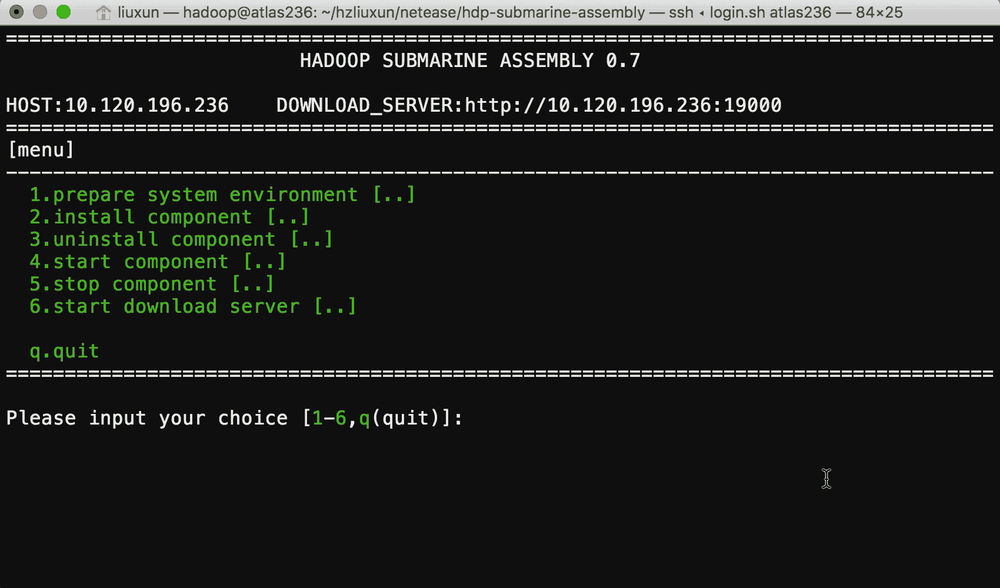

## hdp submarine assembly

### Introduction

Before introducing the **hdp-submarine-assembly** project, let's first explain the **Hadoop {Submarine}** project. Hadoop {Submarine} is the latest machine learning framework subproject in the Hadoop 3.2 release. He allows Hadoop to support `Tensorflow`, `MXNet`,` Caffe`, `Spark`, etc. A variety of deep learning frameworks provide a full-featured system framework for machine learning algorithm development, distributed model training, model management, and model publishing, combined with hadoop's intrinsic data storage and data processing capabilities to enable data scientists to Good mining and the value of the data.

Hadoop has enabled YARN to support the resource scheduling mode of the Docker container in version 2.9. **Hadoop {Submarine}** then uses YARN to schedule and run the distributed deep learning framework in the form of a Docker container.

Since the distributed deep learning framework needs to run in multiple Docker containers and needs to be able to coordinate the various services running in the container, complete the services of model training and model publishing for distributed machine learning. Involving multiple system engineering problems such as `DNS`, `Docker`, `GPU`, `Network`, `graphics card`, `operating system kernel` modification, etc. It is very difficult and time-consuming to properly deploy the **Hadoop {Submarine}** runtime environment.

In order to reduce the difficulty of deploying components such as docker 2.9 or higher, we have developed this **hdp-submarine-assembly** project to deploy the **Hadoop {Submarine}** runtime environment, providing a one-click installation script or step-by-step installation. Unload, start, and stop individual components, and explain the main parameter configuration and considerations for each step. We also submitted a [Chinese manual](InstallationGuideChineseVersion.md) and an [English manual](InstallationGuide.md) for the **Hadoop {Submarine}** runtime environment to the hadoop community to help users deploy more easily and find problems in a timely manner.

### prerequisites

**Hdp-submarine-assembly** currently only supports operating systems based on `centos-release-7-3.1611.el7.centos.x86_64` and above.

### Configuration instructions

Before deploying with hdp-submarine-assembly, you can refer to the existing configuration parameters and format in the `install.conf` file, and configure the following parameters according to your usage:

+ **DNS Configuration**

  LOCAL_DNS_HOST: server-side local DNS IP address configuration, which can be viewed from `/etc/resolv.conf`

  YARN_DNS_HOST: yarn dns server started IP address

+ **ETCD Configuration**

  Machine learning is a computationally-density system that requires very high data transmission performance. Therefore, we use the ETCD network component with the least network efficiency loss. It can support the overlay network through BGP routing and support tunnel mode when deployed across the equipment room.

  You need to select at least three servers as the running server for ETCD, which will make **Hadoop {Submarine}** better fault tolerant and stable.

  Enter the IP array as the ETCD server in the ETCD_HOSTS configuration item. The parameter configuration is generally like this:

  ETCD_HOSTS=(hostIP1 hostIP2 hostIP3). Note that spaces between multiple hostIPs should be separated by spaces.

+ **DOCKER_REGISTRY Configuration**

  You first need to install an image management repository for the available docker. This image repository is used to store the image files of the various deep learning frameworks you need, and then configure the IP address and port of the mirror repository. The parameter configuration is generally the same :

  DOCKER_REGISTRY="10.120.196.232:5000"

+ **DOWNLOAD_SERVER Configuration**

  By default, **hdp-submarine-assembly** downloads all dependencies directly from the network (eg GCC, Docker, Nvidia drivers, etc.), which often takes a lot of time and cannot be used in environments where some servers cannot connect to the Internet. Deployment, so we built the HTTP download service in **hdp-submarine-assembly**, you only need to run **hdp-submarine-assembly** on a server that can connect to the Internet, you can download the dependencies for all other servers, you only need Follow these configurations:

  1. First, you need to configure `DOWNLOAD_SERVER_IP` as a server IP address that can connect to the Internet, and configure `DOWNLOAD_SERVER_PORT` as a port that is not very common.
  2. After running the `hdp-submarine-assembly/install.sh` command on the server where `DOWNLOAD_SERVER_IP` is located, select the `[start download server]` menu item in the installation interface. **hdp-submarine-assembly** will download all the dependencies of the deployment to the server. In the `hdp-submarine-assembly/downloads` directory, start an HTTP download service with the `python -m SimpleHTTPServer ${DOWNLOAD_SERVER_PORT}` command. Do not close the **hdp-submarine-assembly** running on this server.
  3. When you run the `hdp-submarine-assembly/install.sh` command on other servers and follow the `[install component]` menu in the installation interface to install each component in turn, it will automatically download the dependencies from the server where `DOWNLOAD_SERVER_IP` is located for installation and deployment. .
  4. **DOWNLOAD_SERVER** Another useful thing is that you can manually download the dependencies by hand, put them in the `hdp-submarine-assembly/downloads` directory of one of the servers, and then open `[start download server]`, so that you can The cluster provides the ability to deploy offline deployments.

+ **YARN_CONTAINER_EXECUTOR_PATH Configuration**

  How to compile YARN's container-executor: You will execute the `mvn package -Pnative -DskipTests` command in the `hadoop/hadoop-yarn-project/hadoop-yarn/hadoop-yarn-server/hadoop-yarn-server-nodemanager` directory, which will compile The `./target/native/target/usr/local/bin/container-executor` file.

  You need to fill in the full path of the container-executor file in the `YARN_CONTAINER_EXECUTOR_PATH` configuration item.

+ **YARN_HIERARCHY Configuration**

  Please keep the same configuration as `yarn.nodemanager.linux-container-executor.cgroups.hierarchy` in the `yarn-site.xml` configuration file of the YARN cluster you are using. If this is not configured in `yarn-site.xml`, Then the default is `/hadoop-yarn`.

+ **YARN_NODEMANAGER_LOCAL_DIRS Configuration**

  Please keep the same configuration as `yarn.nodemanager.local-dirs` in the `yarn-site.xml` configuration file of the YARN cluster you are using.

+ **YARN_NODEMANAGER_LOG_DIRS Configuration**

  Please keep the same configuration as `yarn.nodemanager.log-dirs` in the `yarn-site.xml` configuration file of the YARN cluster you are using.

### Instructions for use

**Hdp-submarine-assembly** is completely written in shell script. It does not need to install any deployment tools such as ansible. It avoids different server management specifications of different company users and causes the program to be uncommon. For example, some computer rooms do not allow ROOT users to directly remotely through SHELL. Server operation, etc.

The deployment process of **hdp-submarine-assembly** is completely performed by selecting the operation in the menu. It avoids misoperations. You can also install, uninstall, and start any component in each step through various menu items. And the various components are stopped, and the flexibility is very good. After some components have problems, the system can also be diagnosed and repaired by **hdp-submarine-assembly**.

**hdp-submarine-assembly** The log information is displayed on the screen during the deployment process. The log information has three font colors:

+ Red font color: Indicates that the component installation has an error and the deployment has terminated.

+ Green text color: The component is installed properly and the deployment is working properly.

+ Blue text color: You need to manually enter the command in another SHELL terminal according to the prompt information. Generally, modify the operating system kernel configuration operation, and follow the prompt information to operate it.

**Start hdp-submarine-assembly**

Run the `hdp-submarine-assembly/install.sh` command to start. The deployment program first detects the IP address of the network card in the server. If the server has multiple network cards or multiple IP addresses configured, it will be displayed in the form of a list. Select the one you actually use. IP address.

**hdp-submarine-assembly**  Menu description：

### Deployment instructions

The deployment process is as follows:

1. Refer to the configuration instructions to configure the install.conf file based on your server usage.

2. Copy the entire **hdp-submarine-assembly** folder to all server nodes

3. First in the server configured as **DOWNLOAD_SERVER**

   + Run the `hdp-submarine-assembly/install.sh` command

   + Select the `[start download server]` menu item in the installation interface, and wait for the download of each dependency package to start the HTTP service.

4. In other servers that need to be deployed

   Run the `hdp-submarine-assembly/install.sh` command to display the following menu in the main menu **[Main menu]**:

   + prepare system environment
   + install component
   + uninstall component
   + start component
   + stop component
   + start download server

5. **prepare system environment**

   + prepare operation system

   + prepare operation system kernel

   + prepare GCC version

   + check GPU

   + prepare user&group

   + prepare nvidia environment

6. install component

   + instll etcd
   + instll docker
   + instll calico network
   + instll nvidia driver
   + instll nvidia docker
   + instll yarn container-executor
   + instll submarine autorun script

7. uninstall component

   - uninstll etcd
   - uninstll docker
   - uninstll calico network
   - uninstll nvidia driver
   - uninstll nvidia docker
   - uninstll yarn container-executor
   - uninstll submarine autorun script

8. start component

   - start etcd
   - start docker
   - start calico network

9. stop component

   - stop etcd
   - stop docker
   - stop calico network

10. start download server

